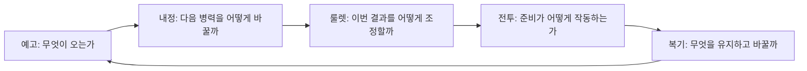

# OMENWARD 예고·군수 중심 화면과 모션 Blueprint

상태: SPECIFIED_DESIGN / ART_CANDIDATE_REVIEW. 승인 근거: 2026-09-10 ‘좋아 권장안대로 진행해’. 상위 연구: `docs/benchmarks/OMENWARD_SYSTEM_SCREEN_ART_REDESIGN_REVIEW_2026-09-10.md`. 승인된 방향을 구체화한 설계이며 신규 gameplay 구현/런타임 PASS가 아니다. 핵심은 룰렛 병력 구성과 단일전선 자동전투다.

## 1. 플레이어가 반복하는 다섯 질문



예고·복기는 별도 탭을 추가하지 않는다. 예고는 공통 상단 정보, 복기는 전선 결과 상태다. 세 탭은 룰렛/내정/전선을 유지한다.

## 2. 상태·시간·입력 계약

| 상태 | 화면과 주요 행동 | 시간 | 실패/경계 |
|---|---|---|---|
| 준비 | 공세 예고, 건설/업그레이드, 룰렛 준비 | 전투 시계 정지 | 구매 불가면 부족 자원/잠금 이유 표시 |
| 룰렛 회전 | 결과 정지 대기 | 전투 시계 정지, 회전 연출만 재생 | 중복 클릭·탭 이동은 추가 회전/비용을 발생시키지 않음 |
| 결과 조정 | 제한된 행·열 이동, 변화 미리보기 | 전투 시계 정지 | 이동권 0이면 미리보기와 확정 가능 여부를 구별 |
| 출전 확인 | 획득 병력·현재 편성·예고를 함께 표시 | 전투 시계 정지 | 돌아가기는 아직 확정 전 편성 확인으로만; 회전 결과 재추첨 없음 |
| 전투 | 병력 역할, 위협, 제한된 전술, 정지/배속 | 명시한 속도로 진행 | 탭은 탐색만 바꿈. 내정·룰렛은 보기 전용, 다음 준비에서 편집 가능 |
| 복기 | 주요 사건·손실·보상·다음 준비 | 전투 종료 | 같은 결과 재진입으로 보상 중복 수령 금지 |
| 맵 완료 | 구간 결과→다음 전선 진입 | 사용자 확인까지 정지 | 최종 구간은 원정 결과; 다음 맵 버튼 없음 |

전투 중 관리 버튼은 ‘다음 준비에서 변경 가능’을 보여 준다. 자동 구매 예약 큐는 추가하지 않는다. 정지 버튼은 전술 관찰을 위한 명시 조작이다. 탭 이동만으로 정지/재개하지 않는다. 준비·복기 대기 중 자동생산이 무한 누적되지 않도록 생산 시계도 함께 정지하는 설계다. 실제 시간값·생산량은 밸런스 확정 전이다.

## 3. 화면별 와이어프레임

공통 프레임: 상단 한 줄 5구간 진행 → 자원/상태/다음 공세 → 가장 큰 전투 영역 → 세 탭 → 활성 작업 영역. 좁은 화면에서는 상세 정보만 접고 주요 행동은 한 단계로 유지한다. 최초 target은 프로젝트의 960×540 논리 화면을 기준으로 후보 가독성을 확인하되 최종 UI 치수 확정은 아니다.

```text
준비 / 내정                         준비 / 룰렛
┌ 공통 진행·자원·예고 ──────┐       ┌ 공통 진행·자원·예고 ──────┐
│ 현재 전장 / 배치된 병력    │       │ 현재 전장 / 배치된 병력    │
├ 룰렛 | 내정 | 전선 ───────┤       ├ 룰렛 | 내정 | 전선 ───────┤
│ 활성 슬롯 6+점령 / 잠김   │       │ 공급 요약 → 3×3 결과      │
│ 선택 건물: 현재 → 변경 후 │       │ 제한 조작 / 결과 차이     │
│ 토큰 공급·생산 효과       │       │ 이번 획득 병력            │
│ [건설/업그레이드]         │       │ [회전] 또는 [출전 확인]   │
└──────────────────────────┘       └──────────────────────────┘

전투 / 전선                         전투 종료 / 복기
┌ 진행·공세·명시적 속도 ────┐       ┌ 진행·이번 결과 ───────────┐
│ 병종과 교전이 보이는 전장 │       │ 종료된 전장·생존 병력     │
│ 준비 포즈→타격→결과      │       │ 주요 사건 1개 강조        │
├ 룰렛 | 내정 | 전선 ───────┤       ├ 룰렛 | 내정 | 전선 ───────┤
│ 현재 위협 / 병력 요약     │       │ 관찰 사실 / 관련 편성     │
│ 전술 / 재사용 가능 상태   │       │ 손실·보상 / 상세 펼치기   │
│ [정지/재개]               │       │ [다음 준비/다음 전선]     │
└──────────────────────────┘       └──────────────────────────┘
```

위험 색만으로 뜻을 전달하지 않고 아이콘+짧은 문구를 사용한다. tooltip에 필수 규칙을 숨기지 않는다. 확률 UI는 토큰 구성 변화를 사실로 보여 주고, ‘승률 증가’는 계산 근거가 없으면 표시하지 않는다.

## 4. 대표 편성 사례와 반증 조건

다음은 시험 시나리오다. 승리/최적 비용을 미리 선언하지 않는다. 동일 seed·공세·투입 예산으로 비교한다. 아직 없는 방어 관통 등의 기능은 실제 데이터 지원 확인 전 효과로 가정하지 않는다.

| 공세 | 대응 A | 대응 B | 확인할 차이·실패 조건 |
|---|---|---|---|
| 전열 압박+후속 사수 | 방어병으로 시간을 확보하고 궁병 공격 지속 | 근접 비중을 높여 전열을 빠르게 줄임 | 방어병 생존 시간, 후열 손실, 투입 예산. 어느 쪽도 대응 불가면 예고/기본 편성 수정 |
| 다수 경량 적 | 공격 빈도와 병력 수 중심 | 실제 지원되는 범위공격 병종 중심 | 단일 대상 낭비와 범위공격 활용. 범위공격이 없으면 미지원으로 기록 |
| 점령지 상실 직전 | 기본 6슬롯에 핵심 공급 보존 | 추가 슬롯에 고수익/특화 공급 배치 | 즉시 비활성 규칙 유지. 잠금 후 회복할 수 없는 단일 경로면 경제 조정 후보 |
| 불리한 룰렛 결과 | 보유 병력과 현재 공급으로 제한 조정 | 다음 준비를 위한 건물 구성 변경 | 무한 재추첨 금지. 치명적 공세에 유효 대응이 전혀 없으면 실패 fixture |

사람 검토 질문: 전투 전 ‘무엇이 오고 무엇을 바꿨는가’, 전투 후 ‘실제로 어떤 병력이 기여했고 다음에는 무엇을 바꿀 것인가’. 자동 로그는 설명을 돕고 플레이어의 이해를 대신 증명하지 않는다.

## 5. 실제 구현과 연결할 책임

| 책임 | 현재 확인 경로 | 다음 변경 경계 |
|---|---|---|
| 진행·명령 상태 | `scripts/core/stage_run.gd` | 한 상태가 시계·주요 입력 권한 소유 |
| 룰렛 결과 | `scripts/roulette/roulette_service.gd` | 결과 snapshot과 비용 단일 적용; UI는 읽기/명령만 |
| 건물 규칙 | `scripts/data/building_definition.gd` | 공급/생산/잠금 효과의 정확한 의미 확인 |
| 병종 | `scripts/data/unit_archetype_profile.gd` | 실제 능력과 사례 대조 |
| 캐릭터 표시 | `scripts/units/unit_view.gd`, `scenes/units/unit.tscn` | static idle에서 상태 animation consumer로 전환 필요 |
| 진영별 시각 | `scripts/data/faction_visual_profile.gd` | source/pivot/state metadata 연결 |
| 미병합 close view | PR257 `scripts/ui/battle_focus_view.gd` | 읽기 전용 비교. 흡수/수정하지 않음 |

기존 세이브·게임 수치·PR257 코드를 이 문서 작성으로 변경하지 않는다. 구현은 exact baseline과 상태 소유권을 대조한 별도 패킷에서 실행한다.

## 6. 신규 시안과 제작 상태


- ID: OMW-REPLAN-ART-20260910-FIELD-MOTION-V2.
- 상태: GENERATED_CANDIDATE / ASSISTANT_VISUAL_REVIEWED / USER_SELECTION_PENDING.
- consumer: 이 Blueprint의 전장·병종·공격 키포즈 검토. runtime consumer 없음.
- 생성: built-in image model; 기존 그림을 재사용하지 않은 신규 board. V1에서 베일 크기가 과도해 V2로 크기만 보정.
- source: `C:/Users/user/.codex/generated_images/01a04af4-0452-7a13-9b6e-1a6077568d72/exec-31a9dbb7-8102-44e9-8d36-3214ee20ad9a.png`.
- repository: `docs/images/candidates/replan-20260910/field-and-motion-study-v2.png`.
- SHA-256: `DD06D660D14DFF66FDF8FBD08FCA7DE498F97C0E7E2991A72ADF950BFF76F0AD`.
- Prompt: original single-front side-view storybook SD tactical miniatures, navy/ivory allies, nonhuman violet carapace Veil, open ochre ground, edge-only props, one left tower; lower strip same shield soldier anticipation/contact/recovery. Correction: regular enemy scale comparable to allies, preserve board layout and poses.
- 검토: 열린 이동 공간, 진영 대비, 괴물형 베일 및 공격 키포즈 확인. 하단 포즈는 동일 cell/pivot의 연속 프레임이 아니므로 재생 sheet로 사용 금지. 원경 병사 중 일부는 저대비이며 실제 전투 개체로 납품하지 않음.

## 7. 모션 납품 계약

대표 방어병 pair를 첫 후보로 삼는다. 각 상태는 새 이미지 모델에서 동일 캐릭터/장비/크기/방향을 유지하며 제작한다. 기존 board를 잘라 움직이는 것만으로 완료 처리하지 않는다.

| 상태 | 필요한 동작 | 시간·이벤트 | 검사 |
|---|---|---|---|
| idle | 무게중심과 방어면 유지 | loop | 발·장비가 갑자기 이동하지 않음 |
| move | 보폭과 지면 접촉 변화 | loop, 이동속도와 대응 | 바닥 미끄러짐·뒷걸음 확인 |
| attack | 준비→접촉→회복 | contact 1회, attack cycle ID | 중복 판정·추가 팔·무기 교체 없음 |
| hit | 짧은 반응 | 비치명 반응 우선순위 명시 | 피격이 공격을 무한 취소하지 않음 |
| death | 중심 붕괴와 전투 종료 | one-shot, 종료 상태 유지 | 사망 뒤 공격/이동 재개 없음 |

각 상태는 cell dimensions, frame count, duration array, loop, ground baseline, pivot, facing, trim offset, event index를 갖는다. 초깃값은 pilot 실물로 결정한다. 진영별 그림 변경이 게임 공격속도를 바꾸지 않는다. 배속에서도 simulation event가 판정을 소유하며 렌더 프레임을 건너뛰어도 타격이 누락되지 않게 설계한다.

Aseprite는 생성된 개별 프레임을 후보 복사본에서 정리한다. 현재 연결에는 tag 생성 기능이 없으므로 상태별 `.aseprite`와 PNG+JSON부터 사용한다. 이번 보드는 평면 검토 이미지여서 Aseprite 변환 필요가 없다. 다음 개별 프레임 납품에서 duration/alpha/pivot/export readback을 실행한다.

## 8. 검증과 다음 작업

문서 검사·이미지 hash/크기 확인은 이번 작업 범위다. 새 상태 consumer 구현, 수치 시뮬레이션, 모션 프레임 생성, Aseprite 상태 sheet, Godot runtime, Human은 미완료다. 새 아트 후보 선택 후 첫 pair의 개별 frame pilot으로 이어진다. 스타일 보정 시 이 후보만 교체하며 기존 빌드 자산은 보존한다.

검토 항목: 1) 단일전선/3탭 유지 2) 탭과 시간 소유권 분리 3) 사례의 미지원 능력 가정 방지 4) 그림 크기 보정과 프레임 상태 구별 5) 기존 PR/저장/자산 보호. 실패/반증 조건은 각 절에 기록했다.
