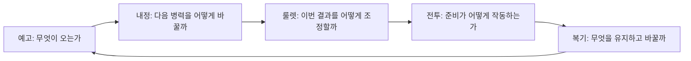
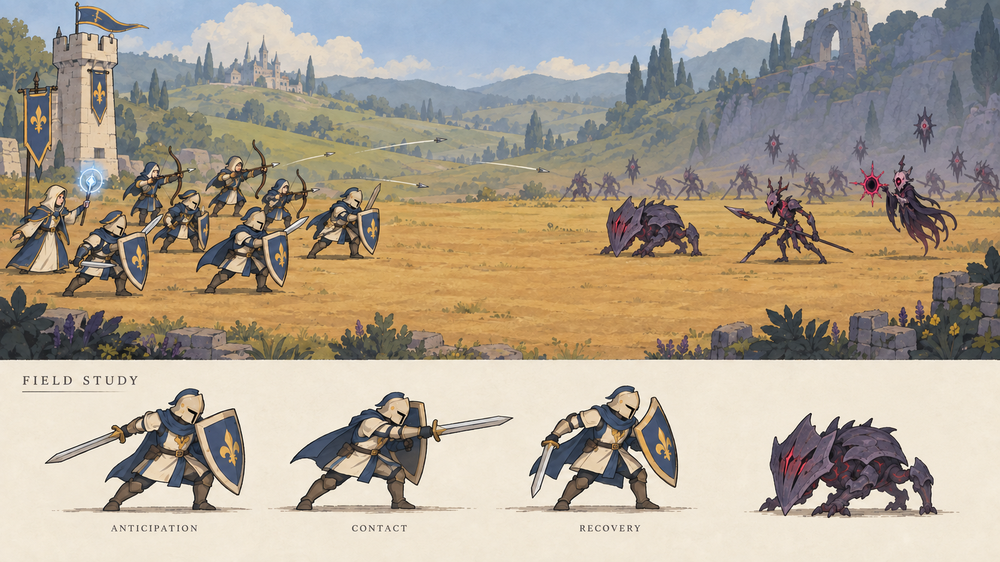
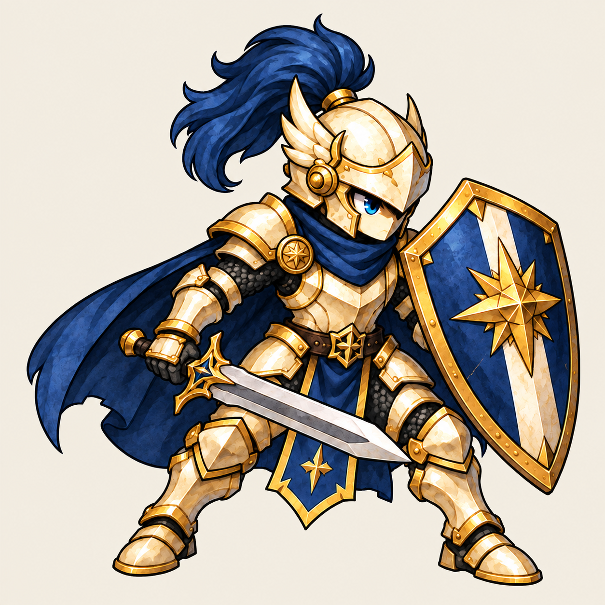

# OMENWARD 예고·군수 중심 화면과 모션 Blueprint

상태: SPECIFIED_DESIGN / ART_CANDIDATE_REVIEW. 승인 근거: 2026-09-10 ‘좋아 권장안대로 진행해’. 상위 연구: `docs/benchmarks/OMENWARD_SYSTEM_SCREEN_ART_REDESIGN_REVIEW_2026-09-10.md`. 승인된 방향을 구체화한 설계이며 신규 gameplay 구현/런타임 PASS가 아니다. 핵심은 룰렛 병력 구성과 단일전선 자동전투다.

## 1. 플레이어가 반복하는 다섯 질문



예고·복기는 별도 탭을 추가하지 않는다. 예고는 공통 상단 정보, 복기는 전선 결과 상태다. 세 탭은 룰렛/내정/전선을 유지한다.

## 2. 상태·시간·입력 계약

| 상태 | 화면과 주요 행동 | 시간 | 실패/경계 |
|---|---|---|---|
| 준비 | 공세 예고, 건설/업그레이드, 룰렛 준비 | 전투 시계 정지 | 구매 불가면 부족 자원/잠금 이유 표시 |
| 룰렛 회전 | 결과 정지 대기 | 전투 시계 정지, 회전 연출만 재생 | 중복 클릭·탭 이동은 추가 회전/비용을 발생시키지 않음 |
| 결과 조정 | 제한된 행·열 이동, 변화 미리보기 | 전투 시계 정지 | 이동권 0이면 미리보기와 확정 가능 여부를 구별 |
| 출전 확인 | 획득 병력·현재 편성·예고를 함께 표시 | 전투 시계 정지 | 돌아가기는 아직 확정 전 편성 확인으로만; 회전 결과 재추첨 없음 |
| 전투 | 병력 역할, 위협, 제한된 전술, 정지/배속 | 명시한 속도로 진행 | 탭은 탐색만 바꿈. 내정·룰렛은 보기 전용, 다음 준비에서 편집 가능 |
| 복기 | 주요 사건·손실·보상·다음 준비 | 전투 종료 | 같은 결과 재진입으로 보상 중복 수령 금지 |
| 맵 완료 | 구간 결과→다음 전선 진입 | 사용자 확인까지 정지 | 최종 구간은 원정 결과; 다음 맵 버튼 없음 |

전투 중 관리 버튼은 ‘다음 준비에서 변경 가능’을 보여 준다. 자동 구매 예약 큐는 추가하지 않는다. 정지 버튼은 전술 관찰을 위한 명시 조작이다. 탭 이동만으로 정지/재개하지 않는다. 준비·복기 대기 중 자동생산이 무한 누적되지 않도록 생산 시계도 함께 정지하는 설계다. 실제 시간값·생산량은 밸런스 확정 전이다.

## 3. 화면별 와이어프레임

공통 프레임: 상단 한 줄 5구간 진행 → 자원/상태/다음 공세 → 가장 큰 전투 영역 → 세 탭 → 활성 작업 영역. 좁은 화면에서는 상세 정보만 접고 주요 행동은 한 단계로 유지한다. 최초 target은 프로젝트의 960×540 논리 화면을 기준으로 후보 가독성을 확인하되 최종 UI 치수 확정은 아니다.

```text
준비 / 내정                         준비 / 룰렛
┌ 공통 진행·자원·예고 ──────┐       ┌ 공통 진행·자원·예고 ──────┐
│ 현재 전장 / 배치된 병력    │       │ 현재 전장 / 배치된 병력    │
├ 룰렛 | 내정 | 전선 ───────┤       ├ 룰렛 | 내정 | 전선 ───────┤
│ 활성 슬롯 6+점령 / 잠김   │       │ 공급 요약 → 3×3 결과      │
│ 선택 건물: 현재 → 변경 후 │       │ 제한 조작 / 결과 차이     │
│ 토큰 공급·생산 효과       │       │ 이번 획득 병력            │
│ [건설/업그레이드]         │       │ [회전] 또는 [출전 확인]   │
└──────────────────────────┘       └──────────────────────────┘

전투 / 전선                         전투 종료 / 복기
┌ 진행·공세·명시적 속도 ────┐       ┌ 진행·이번 결과 ───────────┐
│ 병종과 교전이 보이는 전장 │       │ 종료된 전장·생존 병력     │
│ 준비 포즈→타격→결과      │       │ 주요 사건 1개 강조        │
├ 룰렛 | 내정 | 전선 ───────┤       ├ 룰렛 | 내정 | 전선 ───────┤
│ 현재 위협 / 병력 요약     │       │ 관찰 사실 / 관련 편성     │
│ 전술 / 재사용 가능 상태   │       │ 손실·보상 / 상세 펼치기   │
│ [정지/재개]               │       │ [다음 준비/다음 전선]     │
└──────────────────────────┘       └──────────────────────────┘
```

위험 색만으로 뜻을 전달하지 않고 아이콘+짧은 문구를 사용한다. tooltip에 필수 규칙을 숨기지 않는다. 확률 UI는 토큰 구성 변화를 사실로 보여 주고, ‘승률 증가’는 계산 근거가 없으면 표시하지 않는다.

## 4. 대표 편성 사례와 반증 조건

다음은 시험 시나리오다. 승리/최적 비용을 미리 선언하지 않는다. 동일 seed·공세·투입 예산으로 비교한다. 아직 없는 방어 관통 등의 기능은 실제 데이터 지원 확인 전 효과로 가정하지 않는다.

| 공세 | 대응 A | 대응 B | 확인할 차이·실패 조건 |
|---|---|---|---|
| 전열 압박+후속 사수 | 방어병으로 시간을 확보하고 궁병 공격 지속 | 근접 비중을 높여 전열을 빠르게 줄임 | 방어병 생존 시간, 후열 손실, 투입 예산. 어느 쪽도 대응 불가면 예고/기본 편성 수정 |
| 다수 경량 적 | 공격 빈도와 병력 수 중심 | 실제 지원되는 범위공격 병종 중심 | 단일 대상 낭비와 범위공격 활용. 범위공격이 없으면 미지원으로 기록 |
| 점령지 상실 직전 | 기본 6슬롯에 핵심 공급 보존 | 추가 슬롯에 고수익/특화 공급 배치 | 즉시 비활성 규칙 유지. 잠금 후 회복할 수 없는 단일 경로면 경제 조정 후보 |
| 불리한 룰렛 결과 | 보유 병력과 현재 공급으로 제한 조정 | 다음 준비를 위한 건물 구성 변경 | 무한 재추첨 금지. 치명적 공세에 유효 대응이 전혀 없으면 실패 fixture |

사람 검토 질문: 전투 전 ‘무엇이 오고 무엇을 바꿨는가’, 전투 후 ‘실제로 어떤 병력이 기여했고 다음에는 무엇을 바꿀 것인가’. 자동 로그는 설명을 돕고 플레이어의 이해를 대신 증명하지 않는다.

## 5. 실제 구현과 연결할 책임

| 책임 | 현재 확인 경로 | 다음 변경 경계 |
|---|---|---|
| 진행·명령 상태 | `scripts/core/stage_run.gd` | 한 상태가 시계·주요 입력 권한 소유 |
| 룰렛 결과 | `scripts/roulette/roulette_service.gd` | 결과 snapshot과 비용 단일 적용; UI는 읽기/명령만 |
| 건물 규칙 | `scripts/data/building_definition.gd` | 공급/생산/잠금 효과의 정확한 의미 확인 |
| 병종 | `scripts/data/unit_archetype_profile.gd` | 실제 능력과 사례 대조 |
| 캐릭터 표시 | `scripts/units/unit_view.gd`, `scenes/units/unit.tscn` | static idle에서 상태 animation consumer로 전환 필요 |
| 진영별 시각 | `scripts/data/faction_visual_profile.gd` | source/pivot/state metadata 연결 |
| 미병합 close view | PR257 `scripts/ui/battle_focus_view.gd` | 읽기 전용 비교. 흡수/수정하지 않음 |

기존 세이브·게임 수치·PR257 코드를 이 문서 작성으로 변경하지 않는다. 구현은 exact baseline과 상태 소유권을 대조한 별도 패킷에서 실행한다.

## 6. 신규 시안과 제작 상태



- ID: OMW-REPLAN-ART-20260910-FIELD-MOTION-V2.
- 상태: LAYOUT_REFERENCE_ONLY / CHARACTER_QUALITY_REJECTED_BY_USER_FEEDBACK.
- consumer: 이 Blueprint의 전장·병종·공격 키포즈 검토. runtime consumer 없음.
- 생성: built-in image model; 기존 그림을 재사용하지 않은 신규 board. V1에서 베일 크기가 과도해 V2로 크기만 보정.
- source: `C:/Users/user/.codex/generated_images/01a04af4-0452-7a13-9b6e-1a6077568d72/exec-31a9dbb7-8102-44e9-8d36-3214ee20ad9a.png`.
- repository: `docs/images/candidates/replan-20260910/field-and-motion-study-v2.png`.
- SHA-256: `DD06D660D14DFF66FDF8FBD08FCA7DE498F97C0E7E2991A72ADF950BFF76F0AD`.
- Prompt: original single-front side-view storybook SD tactical miniatures, navy/ivory allies, nonhuman violet carapace Veil, open ochre ground, edge-only props, one left tower; lower strip same shield soldier anticipation/contact/recovery. Correction: regular enemy scale comparable to allies, preserve board layout and poses.
- 검토: 열린 이동 공간, 진영 대비, 괴물형 베일 및 공격 키포즈 확인. 하단 포즈는 동일 cell/pivot의 연속 프레임이 아니므로 재생 sheet로 사용 금지. 원경 병사 중 일부는 저대비이며 실제 전투 개체로 납품하지 않음.

### 6.1 사용자 품질 피드백과 방패병 V3

2026-09-10 사용자: 기존 이미지보다 품질 저하 → 기존 원화 수준의 갑옷 입체감·금속/천 구별·눈매·SD 매력을 회복하는 권장안 진행 승인. 이는 새 결과의 최종 승인과 구별한다. 비교에서는 단일 원화와 전장 보드의 크기 차이를 고려하되 V2의 평면화 자체도 교정한다.



- ID: OMW-REPLAN-ART-20260910-WARD-SHIELD-V3.
- 상태: GENERATED_CANDIDATE / ASSISTANT_VISUAL_REVIEWED / USER_SELECTION_PENDING. Runtime 미적용.
- consumer: 방패병 원화 품질 검토와 [동일 이미지 크기 비교](../images/candidates/replan-20260910/ward-shield-quality-review.html). 최종 예정 consumer는 UnitView지만 현재 연결하지 않음.
- 참고: 사용자 제공 `C:/Users/user/Downloads/GameAssetInbox/exec-fa7d9874-ec24-40f3-a408-04f28bcf5e5b.png`. 품질/시각 언어 참고용이며 제품에 재사용하지 않음. 권리·참조 독립성 최종 판정은 미완료.
- 도구: built-in image model, 신규 생성 후 배경 한정 교정 1회. Aseprite는 아직 필요한 프레임 정리가 없어 미사용.
- source: `C:/Users/user/.codex/generated_images/01a04af4-0452-7a13-9b6e-1a6077568d72/exec-d1f434d9-a55f-4b48-8d9a-22261f4a266e.png`.
- repository: `docs/images/candidates/replan-20260910/ward-shield-quality-v3.png`.
- SHA-256: `55C111E94BC254144533CE2244C8B5886E5F146D86569713642518F028065C8D`.
- 디코드: 1254×1254 RGB, alpha 없음. 정지 원화이며 투명 sprite/animation으로 등록 금지.
- 검토: 눈매와 금속 면의 명암, 남색 천의 볼륨, 전면 방패와 검, 양발 잘림 없는 구도 확인. 원본 참고와 외형 유사성이 높고 장식 밀도가 높으므로 다른 병종 확장 및 작은 크기에서는 재검토 필요. 사용자 선호 통과를 대신 선언하지 않음.
- 실패와 수정: 최초 `exec-4fcd79c8-4203-40a7-836a-890005fb9245.png`는 투명 배경 요청에도 RGB 바둑판이 들어왔다. 파일 디코드로 확인 후 모델로 불투명 아이보리 배경 검토본을 만들었다. 실패본은 저장소/런타임에 추가하지 않았다. 육안의 바둑판 표시를 실제 alpha 증거로 사용하지 않는다.
- 축소 비교: 동일 PNG를 56/80/112 CSS px로 표시. 56은 현재 UnitView 전체 texture 높이와 대응하고, 112는 2배 표시 참고다. Godot 필터/전투 배경 검증을 대체하지 않는다.

최초 생성 프롬프트:

```text
Use case: stylized-concept. Create ONE NEW polished OMENWARD allied shield infantry character candidate, full-body cutout on a genuinely transparent background. Input image is a rendering-quality and visual-language REFERENCE ONLY, not an edit target. Match its premium hand-painted storybook-fantasy SD charm, layered dimensional ivory metal armor, warm gold bevels, deep navy cloth, bright expressive blue eye, restrained fine watercolor grain and dark crisp contour. Do not flatten into vector shapes or crude board-game tokens. New character design with 2.5–3-head compact proportions, rounded layered breastplate, elegant crescent-wing helmet cheek guards and short swept navy plume, navy scarf and modest cape. Broad navy kite shield with raised ivory vertical inlay and a simple gold compass-star ward emblem, short steel arming sword. THREE-QUARTER SIDE VIEW FACING SCREEN RIGHT, readiness stance suited to side-view battle, shield held toward the right/front, sword angled low to the right with clear silhouette. One character only, exactly two arms and two legs, one hand naturally holds sword and the other holds shield from behind; visible determined cute eye, no extra weapons, no flag, no environment, no lettering or logo. Metal should have convincing curved highlights, deep contact shadows between overlapping plates, separate gold/ivory materials; fabric softly folded with rich navy volumes, controlled hand-painted details, not gritty photorealism or plastic 3D. Keep limbs readable, both boots wholly visible, cape behind body, no floating ornaments. Comfortable empty margin all around, complete sword and shield in frame. High-resolution square illustration, character uses most of canvas. This is single static concept art, NOT an animation sheet. Prioritize the exquisite finish of the reference while making an original usable shield-infantry design.
```

배경 교정 프롬프트: Preserve the single shield soldier design, pose, eye, outlines, armor, sword, shield, cape, plume, painted details, proportions and framing. Remove all gray checkerboard outside the silhouette including gaps; use uniform warm ivory #F3EEE4. No shadow, objects, text or vignette. Clean flat-background concept preview, not a transparent sprite. 모델 편집이므로 캐릭터 픽셀의 동일성까지 보증하지 않는다.

남은 순서: 방패병 품질 확인 → 동일 완성도의 비인간 베일 pair → 승인 후보의 투명 경계와 실제 전장 비교 → 이동/공격 pilot → Aseprite frame/export 검사 → Godot 이벤트 연동. 게임플레이·세이브·기존 승인 자산은 수정하지 않는다.

프로젝트 교훈: 원화 품질과 축소 가독성을 별도 평가한다. 실루엣 우선은 재질/표정 제거 명령이 아니다. 생성 alpha를 반드시 디코드 검사한다. Base 승격은 반복 검증 전까지 후보 교훈으로만 유지하며 공용 규칙을 변경하지 않는다.

검증: project operating contract 및 core documentation 검사 PASS; PNG 디코드/크기/hash readback PASS; 비교 HTML의 동일 PNG 참조 4개 확인. HTML 실제 브라우저 시각 검수, Godot 배경 배치와 필터 비교, 모션, 사용자 최종 품질 판정은 NOT_RUN. 전체 변경 검토에서 원본/기존 PR 보호, 승인 범위, 아트 품질, 실제 alpha, 크기 비교의 증거 한계를 대조했고 intake/roadmap의 낡은 상태 설명도 함께 교정했다.

### 6.2 비인간 베일 pair와 전장 적합성 후보

사용자 후속 ‘좋아 권장안대로 계속 진행해’에 따라 방패병 V3 품질 방향으로 제작을 이어갔다. 이번 새 결과의 최종 승인/정본 등록/런타임 적용은 별도다.

| 후보 | 소비 목적 | 저장소 경로 | SHA-256 |
|---|---|---|---|
| Veil shield V1 | 비인간 방어병 외형·재질·역할과 축소 비교 | `docs/images/candidates/replan-20260910/veil-shield-quality-v1.png` | `8BEC8EC60DA8DBE9F06613060DCE7FD5DE371C33EFE65AC994AFB58A3A8A1994` |
| Shield pair field fit V1 | 새 양 진영과 기존 지형 구도의 화풍 적합성 비교 | `docs/images/candidates/replan-20260910/shield-pair-field-fit-v1.png` | `FB5A93AE39F693A722C8DD14302766639828B3C8C231E8B6F70920DAB206B2D2` |

두 후보 모두 built-in image model 산출물이며 USER_SELECTION_PENDING. 기존 파일을 덮어쓰지 않았다. 원본 경로는 `C:/Users/user/.codex/generated_images/01a04af4-0452-7a13-9b6e-1a6077568d72/` 아래 각각 `exec-e06b2df5-13ce-4626-b321-0f3fb069db9f.png`, `exec-79497d82-2c3c-4a2c-85db-380edab9161b.png`이다.

파일 검증: 베일 1254×1254 RGB, 전장 시안 1672×941 RGB. SHA-256 readback 일치, 비교 HTML의 이미지 참조 9개 실재 확인, core documentation 검사와 diff 형식 검사 PASS. 제품 scripts/scenes/data/assets/skills 변경 없음. 실제 HTML 브라우저 검수·Godot·Human·권리 최종 검수는 NOT_RUN.

베일 비교: 인간 기사 recolor는 REJECT, 참고 원화 수준의 금속성/갑각 명암은 ADAPT, 주둥이·이빨·비늘 관절·발톱을 통한 비인간성은 ADOPT. 방어 역할은 큰 방패와 낮은 자세로 유지한다. 이번 후보는 주둥이와 발톱이 명확하나 방패가 화면 앞 왼쪽에 놓이라는 요청은 반영되지 않았다. 측면 동작 제작에서 방패 면의 방향을 다시 확인한다. 크기와 외곽선은 아군과 함께 검토하되 단일 후보로 베일 전체 종족을 확정하지 않는다.

전장 비교: 아군 3/베일 3, 좌측 방어탑 1개, 끊기지 않는 넓은 이동 공간, 소품 가장자리 배치 확인. 합성 결과에서 검/방패 형태의 세부 변형과 원근에 따른 크기 차이가 있다. 따라서 실제 원화 픽셀 합성, 인게임 캡처, 충돌 범위 또는 애니메이션 continuity의 증거가 아니다. 합성 이미지는 게임 배경 텍스처로 넣지 않는다. 배경과 소품을 분리한다는 제작 계약도 유지한다.

생성 프롬프트 — 베일:

```text
Use case: stylized-concept. Make ONE new OMENWARD Veil shield infantry monster, standalone full body character on a perfectly plain warm ivory background. Reference image is ONLY the shared rendering quality, hand-painted dimensional storybook-fantasy SD style, contour weight and finish. Do NOT recolor the human knight. Create a clearly NONHUMAN compact 2.5-to-3 head creature, hunched powerful torso, digitigrade clawed legs with exposed gray-violet scaled joints, two arms, two legs, horned chitin head grown directly from the body, a short blunt bestial muzzle with a few visible ivory teeth and luminous violet eyes, NO human skin, NO human face, NO wearable human helmet. Layered obsidian-violet carapace plates interlock with dark weathered metal-like edge highlights; convincing curved surfaces and deep overlap shadows matching the reference's painting quality, controlled watercolor grain, not photorealistic gore. Defensive role: huge thick asymmetric carapace buckler in its front LEFT side of image, broad rounded-angular silhouette with 3 short defensive spikes, a small restrained violet fissure near its center. Other clawed hand grips a short heavy chipped cleaver held low, wholly visible. Body faces SCREEN LEFT in three-quarter side view, prepared to brace against the allied shield soldier. Same regular infantry scale and SD world, not a gigantic boss; shoulders broad but not disproportionate. A few short torn dark purple cloth strips at waist, no royal cape or ornament overload. Distinguish carapace, exposed skin, cleaver metal and cloth through painted materials. Clear silhouette, all feet, horns, shield and blade within frame with margin, no floor shadow, no VFX cloud hiding anatomy. Not cute human in demon costume, not a recolored ally, not insect with six limbs, not skull knight, no text, no sheet, no labels. Premium polished character illustration, plain warm ivory background, no checkerboard. This is one still art candidate, not an animation.
```

생성 프롬프트 — 화풍 적합성 합성:

```text
Use case: compositing. Create a WIDE 16:9 OMENWARD battlefield ART FIT PREVIEW, not a screenshot. Input 1 = terrain composition reference: retain its broad uninterrupted ochre battle ground, distant green hills/citadel to the left and gray-violet rocky ridge to right, restrained storybook watercolor palette, single small left defense tower, foreground rocks and shrubs confined to bottom outer edge. Remove ALL old characters, remove bottom white pose strip and ALL labels; do not create roads split by rivers or obstacles. Input 2 = EXACT allied shield soldier design and rendering quality; input 3 = EXACT Veil monster shield soldier design and rendering quality. Integrate only these two unit types: three allies on LEFT facing RIGHT and three monsters on RIGHT facing LEFT, sparse loosely staggered battle formation. All are regular infantry of comparable head/body height, no giant boss. Two foremost soldiers approaching center within sword reach, behind them two per side, no overlap hiding silhouettes. Keep character painted metal/chitin volume, cute SD ally face, nonhuman clawed monster muzzle, gold/navy ally, obsidian violet enemy. Do not simplify units to flat blobs and do not return to the old units from input 1. Units occupy about 20 percent of image height, grounded with subtle contact shadow, foreground units on same baseline, balanced faction numbers. Show background fitting the units, retain airy terrain composition with clear battlefield band. No UI, no text, no labels, no split-screen, no pose chart, no arrows, no river, no building nodes, no new props in movement path. The output is only visual style-fit artwork; preserve the two candidate identities without new equipment or additional arms.
```

검토 순서: (1) 모든 변경의 승인 범위와 기존 자산 보호 (2) 두 신규 이미지의 외형/장비/실루엣 및 역할 (3) 문서와 크기 비교의 source/hash/표시 의미 (4) 원화·합성·모션·runtime 증거의 혼동 (5) Active Context/Decisions/로드맵과 Git/CI 상태를 전 범위 재대조. 방패 위치 미반영과 합성 장비 drift는 위에 남겼으며 runtime 승격 금지로 제한했다. 리뷰를 사용자 품질 승인으로 처리하지 않는다.

자동화 교훈: 동일 캐릭터를 여러 명 배치한 이미지 모델 시안도 장비 동일성을 보장하지 못한다. 이후 motion/engine은 단일 원화와 상태별 검증 프레임을 사용해야 한다. 새 공용 도구 제작이나 Base 계약 변경 없이 기존 alpha/geometry/readback 규칙으로 처리한다.

남은 작업: 새 베일/전장 방향 확인 → 원화 투명 경계·방향 보정 → 방패병 이동/공격의 개별 프레임 pilot → Aseprite duration/pivot/export → 실제 Godot 배치와 이벤트 재생. 아직 프레임 정리 대상이 없어 이번 Aseprite 실행은 NOT_RUN. 기존 정본/계약 CI는 신규 문서·후보 경로를 허용하지 않는 범위 불일치로 실패했으며 검사를 완화하지 않았다. 승인된 재기획을 정확히 표현하는 계약 교정은 별도 검토가 필요하다.

## 7. 모션 납품 계약

선행 순서는 §6의 품질 교정을 우선한다. V2의 평면적 캐릭터를 모션 원화로 확장하지 않는다.

대표 방어병 pair를 첫 후보로 삼는다. 각 상태는 새 이미지 모델에서 동일 캐릭터/장비/크기/방향을 유지하며 제작한다. 기존 board를 잘라 움직이는 것만으로 완료 처리하지 않는다.

| 상태 | 필요한 동작 | 시간·이벤트 | 검사 |
|---|---|---|---|
| idle | 무게중심과 방어면 유지 | loop | 발·장비가 갑자기 이동하지 않음 |
| move | 보폭과 지면 접촉 변화 | loop, 이동속도와 대응 | 바닥 미끄러짐·뒷걸음 확인 |
| attack | 준비→접촉→회복 | contact 1회, attack cycle ID | 중복 판정·추가 팔·무기 교체 없음 |
| hit | 짧은 반응 | 비치명 반응 우선순위 명시 | 피격이 공격을 무한 취소하지 않음 |
| death | 중심 붕괴와 전투 종료 | one-shot, 종료 상태 유지 | 사망 뒤 공격/이동 재개 없음 |

각 상태는 cell dimensions, frame count, duration array, loop, ground baseline, pivot, facing, trim offset, event index를 갖는다. 초깃값은 pilot 실물로 결정한다. 진영별 그림 변경이 게임 공격속도를 바꾸지 않는다. 배속에서도 simulation event가 판정을 소유하며 렌더 프레임을 건너뛰어도 타격이 누락되지 않게 설계한다.

Aseprite는 생성된 개별 프레임을 후보 복사본에서 정리한다. 현재 연결에는 tag 생성 기능이 없으므로 상태별 `.aseprite`와 PNG+JSON부터 사용한다. 이번 보드는 평면 검토 이미지여서 Aseprite 변환 필요가 없다. 다음 개별 프레임 납품에서 duration/alpha/pivot/export readback을 실행한다.

## 8. 검증과 다음 작업

### 2026-09-10 공격 키포즈 pilot V1

후속 진행 승인에 따라 아군 방패병의 동작 제작 가능성을 확인했다. 제품 애니메이션 납품보다 앞선 불투명 키포즈 시험이며 투명 sprite 선행 조건을 통과한 것으로 처리하지 않는다. 방향은 유지하고 테스트 단계만 분리했다.

- 보기: [재생/정지/단계 넘기기](../images/candidates/replan-20260910/attack-pilot-v1/preview.html).
- 납품 위치: `docs/images/candidates/replan-20260910/attack-pilot-v1/`.
- 입력: 모델 신규 anticipation/contact 각 1장 + 기존 ward-shield-quality-v3의 ready 자세. 마지막은 회복 중간 동작이 아니라 대기 자세 재사용이다.
- 모델 원본: generated_images의 기존 thread 폴더 아래 `exec-e1bc5d7a-e29c-4482-b28d-e77daaa0c2c6.png`, `exec-6369f88d-56dc-48c4-a9ac-d71f546e31c8.png`.
- 입력 SHA-256: anticipation `1c29c2a10d4e8efc573a01a4111261b5348fd2a0734cf87c540f1545f0c981ba`; contact `74763321c3933ff10daed5d61e33bfbafb88b34e6ca78bc5c208bffcdc7d8783`; ready는 §6.1과 동일.
- Aseprite 1.3.18.5-dev native MCP 실제 호출: 1254×1254 canvas, character layer, 3 frames, 180/100/320ms, 총 600ms. 시간은 관찰용 임시값이며 게임 공격속도를 변경하지 않음.
- 후보 작업 경로: `C:/Users/user/.local/share/aseprite-local/candidates/omenward-attack-pilot-20260910-v1/`. 원본 복사본만 처리했고 .aseprite/PNG/JSON을 저장소 후보 위치에 보존했다. 실행 파일이나 도구 코드를 저장소에 넣지 않았다.
- export: horizontal, scale1, padding0, trim/rotation 없음, 3762×1254. 두 레이어 중 기본 Layer1은 빈 레이어, character가 실제 입력이다. tags 없음.
- SHA-256: `.aseprite` `cc6976d7be0b5747715d3d8dbfd9de2139955a2a2da78bae1541f620c0b10fdc`; sheet PNG `b897905fcbe887e5f8c3a37a89c6be760df9c3694d47cb9179e77fbe8efdc940`; JSON `8ec5c43e6c9877d06aaeb6871071e901e87491bc6c592093c690ac8094f86b60`.
- MACHINE: 3프레임의 RGB 픽셀이 각 입력과 전부 일치; alpha는 모두255로 불투명; 크기·duration·hash 검사 PASS. Aseprite 패키징 검증이며 그림 완성도 PASS가 아님.
- 시각 검토: 준비→찌르기의 팔 동작은 구분되지만 어깨판·검 폭·천 장식 drift가 있다. 발 위치는 유사하나 정확한 고정/피벗 측정은 미완료다. 3프레임으로 부드러운 회복을 표현하지 못한다. `ART_CONTINUITY_NEEDS_REVISION / NOT_RUNTIME_READY`.
- preview는 시트의 각 cell을 표시하고 같은 duration으로 넘기며 자동 시작하지 않는다. 로컬 브라우저 열기가 timeout되어 실제 브라우저 동작 검수는 NOT_RUN. 페이지 존재를 재생 성공으로 처리하지 않는다.
- 필요한 다음 교정: 독립 생성 프레임의 장비 변화 축소, 준비/타격/복귀 중간 연결, 투명 경계, 발 기준/pivot, 실제 engine 임포트. 공격 판정 event는 미연결이다.

프롬프트 요약: exact source soldier, same ivory/gold/navy armor/shield/emblem/sword, same square framing and planted boots; anticipation draws sword arm back; contact advances sword horizontally right with slight torso lean; exactly two arms, no motion blur/extra weapon/labels; preserve dimensional rendering and plain ivory backdrop. 접촉 입력에는 원화와 준비 프레임을 함께 제공했다. 모든 창작 편집은 built-in image model, Aseprite는 픽셀을 바꾸지 않는 프레임 패키징만 수행했다.

교훈: 한 장의 품질 승인과 연속 프레임의 디자인 유지 능력은 별도다. 이번 pilot은 중간 프레임 양산 전에 반복되는 장비 drift를 드러냈다. 대량 병종 제작을 시작하지 않는다. 공용 Base 변경 없이 기존 continuity 검사 기준을 적용했다.

초기 보드 작업 이후 위 pilot까지 진행했다. 신규 상태 consumer, 수치 시뮬레이션, 최종 모션 연속성·투명화, Godot runtime, Human은 미완료다. 키포즈 생성과 Aseprite 패키징은 위 증거 범위에서만 완료다. 교정 시에도 기존 빌드 자산은 보존한다.

검토 항목: 1) 단일전선/3탭 유지 2) 탭과 시간 소유권 분리 3) 사례의 미지원 능력 가정 방지 4) 그림 크기 보정과 프레임 상태 구별 5) 기존 PR/저장/자산 보호. 실패/반증 조건은 각 절에 기록했다.
