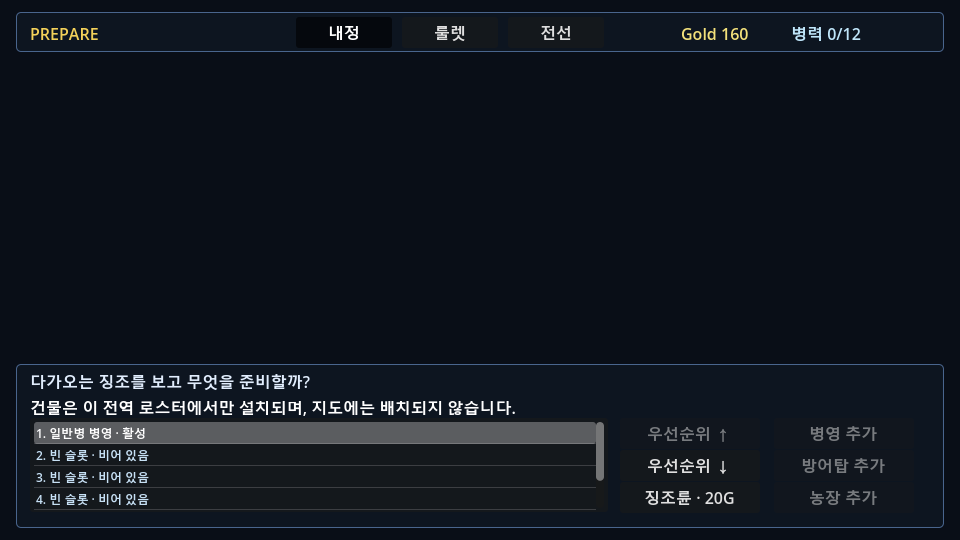

# OMENWARD Five Sequential Front Maps · Runtime Entry Smoke

```yaml
captured_at: 2026-09-02 KST
runtime_target: local Omenward Godot editor instance 20596 / runtime pid 18200
implementation_revision: WORKTREE_UNCOMMITTED__VERIFY_AT_COMMIT
scope: LIVE_ENTRY_AND_PREPARE_SURFACE_ONLY
capture: docs/qa/captures/five_sequential_front_maps/omenward_prepare_entry_2026-09-02.png
capture_dimensions: 960x540
runtime_errors: 0
runtime_warnings: 0
render_nonblank: true
render_possible_clipping: true
sequential_transition_live_proof: NOT_RUN
human_ux: NOT_RUN
device_accessibility_rights_release: NOT_RUN
```

## What was actually run

The current main scene was reloaded in the Omenward editor and started from the title route. The
real `원정 시작` action entered the existing tutorial's `PREPARE` surface. The running tree showed
the retained three work tabs (`내정`, `룰렛`, `전선`), the global building roster, and no battlefield
construction placement controls. The live application error log and diagnostics both returned zero
errors and zero warnings before the game was stopped.

The regular five-map campaign deliberately remained locked at this point: `GameSession.start_stage("regular_stage")`
returned `false` until the tutorial has been won. That is the intended progression boundary, not a
runtime failure. It means this capture is **not** evidence that a live player completed
`수호 성채 → 수호 전진` in this session.



## Evidence boundary

The screenshot analyzer reported `nonblank: true` and `possible_clipping: true`. The latter is a
heuristic signal only; the deliberate PREPARE composition leaves the middle board open and must not
be read as a human readability PASS.

The actual five-map progression, map-local wave ownership, non-final `REVIEW`, explicit
`다음 전선 진입` CTA, preservation of global roster/economy/surviving Lumern units, and final-map-only
victory are covered by the dedicated headless Godot contract. A **live regular-map transition** is
still `NOT_RUN`: it requires a fresh tutorial-complete session or an explicitly scoped runtime test
fixture, and must use the real Review CTA without changing player progression rules.

| Evidence | Result | What it proves | What it does not prove |
|---|---|---|---|
| Local live entry / render | PASS, limited scope | Main scene starts, tutorial PREPARE renders, no runtime diagnostics at capture | Regular-map handoff, human usability, art approval |
| `five_sequential_front_maps_contract_test.gd` | PASS | Five ordered map states, handoff state, retained globals/survivor, final-only victory | Live player operation/readability |
| Full Godot headless batch | 35 / 35 PASS | Current script/resource/scene contracts compose under Godot | Device, human, release gates |
| Full Python batch | 571 PASS | Current canon/router/validator and regression contracts | Runtime/player experience |

## Next gate

`RUNTIME_TECHNICAL_SMOKE_OF_SEQUENTIAL_FRONT_TRANSITION__THEN_USER_VISUAL_CONFIRMATION` remains
current. The five generated map foundations remain candidates only; none was copied into the runtime
or replaced the approved modular foundation.
