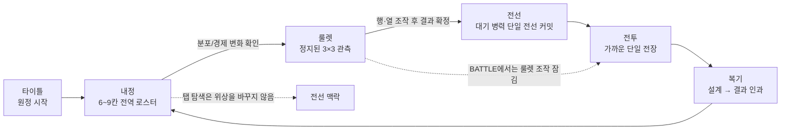

# OMENWARD 단일 전선 지휘 블루프린트 V1

```yaml
blueprint_id: OMW-BLUEPRINT-20260901-SINGLE-FRONT-COMMAND-V1
status: USER_CONFIRMED__ASSET_CANDIDATE_PRODUCTION_AUTHORIZED
approved_authoring_at: 2026-09-01 KST
approval_source: USER_CHAT__"권장안대로 진행해"
scope: BLUEPRINT / WIREFRAME / FLOW_MAP / ASSET_AND_UI_PRODUCTION_BRIEF
new_product_decision: NONE
product_authority: docs/CURRENT_CONFIRMED_DECISIONS.md
active_context: docs/ACTIVE_CONTEXT.md
single_front_owner: docs/design/APPROVED_OMENWARD_SINGLE_MARCH_FRONT_AND_THREE_TAB_COMMAND_2026-08-30.md
battle_presentation_owner: docs/design/APPROVED_OMENWARD_BATTLE_PRIMARY_MARCH_MINIMAP_2026-08-30.md
benchmark_input: docs/benchmarks/OMENWARD_SINGLE_FRONT_COMMAND_BENCHMARK_REVERSE_ENGINEERING_2026-09-01.md
base_adapter: v9.4.4_semantic_pin__current_validator_only
runtime_mutation: NONE_IN_THIS_SPEC
asset_mutation: NONE_IN_THIS_SPEC
human_validation: NOT_RUN
```

## 1. 작업 전 문제

현재 `RunCommandScreen`은 단일 전선, 상단 1줄 행군 미니맵, `내정 / 룰렛 / 전선` 탭,
전역 6~9칸 로스터를 실제로 가지고 있다. 그러나 다음 문제를 블루프린트 단계에서 해소해야 한다.

| 현재 상태 | Blueprint의 교정 목표 | 기대 효과 |
| --- | --- | --- |
| 기능/상태가 구현되어도 화면별 핵심 질문이 한 장의 설계로 고정되지 않음 | 위상별 player question과 잠금 규칙을 화면별로 명시 | 탭이 기능 목록이 아니라 의사결정 흐름으로 읽힘 |
| `BattleFocusView`는 최대 6 유닛을 보여 주지만 현행 그림은 주로 방패병 페어에 묶여 있음 | 병종 역할 → 승인된 시각 profile 매핑을 별도 자산/코드 패킷으로 분리 | 궁수·창병·마법·기병의 역할을 가짜 대체 그림 없이 확장 가능 |
| 현행 코드의 top minimap은 전체폭 1줄이지만, 남아 있는 기술 캡처 일부는 과거 우측 패널 레이아웃 | exact current layout의 새 capture를 구현 acceptance에 포함 | 문서/코드/증거의 화면 정합성 회복 |
| 기존 UI 원본이 충분한데 새 아이콘/프레임을 대량 생성하면 소비처 없는 자산이 생김 | actual consumer가 정해진 자산만 후보 제작 | 자산 용량, 스타일 드리프트, 권리 검토 비용 감소 |

## 2. 변하지 않는 제품 경계

```text
MAP_TOPOLOGY = WARD_CITADEL -> WARD_FORWARD -> CLASH -> VEIL_FORWARD -> VEIL_CITADEL
ACTIVE_FRONT_COUNT = 1
MARCH_MINIMAP = READ_ONLY_FIVE_SECTOR_CONTEXT
MARCH_MINIMAP_LAYOUT = TOP_SINGLE_ROW_STRIP
BUILDING_MAP_PLACEMENT = FORBIDDEN
GLOBAL_BUILDING_ROSTER = 6 + STABLE_PLAYER_HELD_CAPTURE_POINT, MAX 9
FIXED_TOWER_COUNT_PER_ACTIVE_FRONT = 1
RUN_COMMAND_TABS = DOMESTIC / ROULETTE / FRONT
RUN_COMMAND_PHASE = PREPARE -> STOPPED_3X3 -> MANIPULATE -> RESULT_CONFIRM -> COMMIT -> BATTLE -> REVIEW
ROULETTE_IDENTITY = PLAYER_CONSTRUCTED_PROBABILITY_ENGINE
GAMBLING_FANTASY_POSITIONING = FORBIDDEN
```

이 블루프린트는 저장 스키마, 경제 수치, 전투 규칙, 점령 보상, 병력 상성, 룰렛 확률, 유료 모듈,
외부 addon, 세이브/Continue 메뉴를 만들거나 바꾸지 않는다.

## 3. 플레이어 흐름 지도



### 위상과 탭의 책임 분리

| 위상 | 기본 탭 | 플레이어의 한 가지 질문 | 실제 쓰기 권한 | 읽기 전용 맥락 |
| --- | --- | --- | --- | --- |
| `PREPARE` | 내정 | “무엇을 활성화/우선순위화하면 다음 룰렛 분포가 달라지는가?” | 전역 로스터 설치·우선순위 | 점령으로 열린 슬롯, 다음 분포 변화 |
| `PREPARE` | 룰렛 | “현재 무엇을 얻을 수 있는가?” | 룰렛 시작만 허용 | 현재 로스터와 불확실성 |
| `PREPARE` | 전선 | “현재 전선은 어느 구간에 있으며 탑은 누구 소유인가?” | 없음 | 5구간·탑·점령 슬롯 |
| `STOPPED_3X3 / MANIPULATE` | 룰렛 | “어느 행/열 조작이 이 결과를 더 의미 있게 만드는가?” | 제한된 행·열 조작 | 결과 후보와 잔여 조작 수 |
| `RESULT_CONFIRM` | 룰렛 | “이 결과를 확정할 것인가?” | 결과 확정 | 획득 병력·불확실성 경계 |
| `COMMIT` | 전선 | “이 병력 전체를 지금 단일 전선에 되돌릴 수 없게 보낼 것인가?” | atomic commit | 현재 구간·대기 병력·탑 상태 |
| `BATTLE` | 전선 | “지금 누구와 무엇이 싸우며, 전선은 어디에 있는가?” | 제한된 기존 수동 전술만 | 5구간 context strip |
| `REVIEW` | 전선 | “어떤 설계와 사건이 이 결과를 만들었는가?” | 다음 Stage로 넘어가기 | 전투 원인·손실·점령 변화 |

탭 전환은 `active_tab`만 바꾸며 `command_phase`를 우회하지 않는다. BATTLE에서 내정/룰렛을
열람할 수 있어도 로스터와 룰렛은 조작할 수 없다.

## 4. 960×540 와이어프레임

### 공통 프레임

```text
┌──────────────────────────────────────────────────────────────────────────────┐
│ [현재 위상]        [내정] [룰렛] [전선]                Gold     병력/상한     │
├──────────────────────────────────────────────────────────────────────────────┤
│ 전투에서만: 수호 성채 ─ 전진기지 ─ 접전지 ─ 장막 전진기지 ─ 베일 성채        │
│              소유 / 접전 / 현재 구간 / 단 하나의 탑만 표시하는 1줄 미니맵    │
├──────────────────────────────────────────────────────────────────────────────┤
│                       현재 탭의 주 질문에 답하는 표면                         │
├──────────────────────────────────────────────────────────────────────────────┤
│                     현재 위상에서 가능한 단 하나의 다음 행동                 │
└──────────────────────────────────────────────────────────────────────────────┘
```

### 내정 · PREPARE

```text
┌──────────────────────────────────────────────────────────────────────────────┐
│ 내정 · 다음 징조를 설계한다                                      6 / 7 슬롯 │
├───────────────────────────────────────┬──────────────────────────────────────┤
│ 01 일반 병영         활성               │ 선택 항목: 일반 병영               │
│ 02 농장              활성               │ 다음 룰렛 변화: 전열 토큰 ↑        │
│ 03 빈 슬롯           비어 있음          │ 경제 변화: 병력 상한 ↑              │
│ 04 방어 연구소       잠김               │ 잠김 사유: 안정 점령지 필요         │
│ 05~09 …                                 │ [우선순위 ↑] [우선순위 ↓]           │
├───────────────────────────────────────┴──────────────────────────────────────┤
│ 명확한 행동: 설치 / 우선순위 조정 / 징조륜으로 이동                          │
└──────────────────────────────────────────────────────────────────────────────┘
```

- 지도의 건물 모델, 건설 노드, 건물 배치 캔버스는 표시하지 않는다.
- 잠긴 기존 항목은 삭제·환불·숨김이 아니라 `INACTIVE_LOCKED` 상태와 사유를 유지한다.
- 상대적 분포 변화는 보여 주되, 승인 전의 가짜 확률 숫자나 정답 추천은 만들지 않는다.

### 룰렛 · 관측과 조작

```text
┌──────────────────────────────────────────────────────────────────────────────┐
│ 룰렛 · 얻을 병력의 징조를 읽는다                         남은 조작 2          │
├───────────────┬─────────────────────┬────────────────────────────────────────┤
│ 징조 장치      │   ↑  ↑  ↑           │ 중앙 판정 / 현재 완성선               │
│                │ ← [3×3 결과] →      │ 선택 결과가 전선에 주는 의미           │
│                │   ↓  ↓  ↓           │ 획득 병력, 여전히 남는 불확실성         │
├───────────────┴─────────────────────┴────────────────────────────────────────┤
│ 명확한 행동: 행·열 조작 / 결과 확인 / 결과 확정                              │
└──────────────────────────────────────────────────────────────────────────────┘
```

- 화살표와 판정선은 현행 승인된 룰렛 프레임·화살표·장치 자산을 재사용한다.
- 슬롯 연출은 카지노/잭팟이 아니라 관측·조작·확정의 정보 도구여야 한다.

### 전선 · 커밋과 전투

```text
┌──────────────────────────────────────────────────────────────────────────────┐
│ 수호 성채 ─ 전진기지 ─ 접전지 ─ 장막 전진기지 ─ 베일 성채       1줄 미니맵  │
├──────────────────────────────────────────────────────────────────────────────┤
│ 전투 초점 · 현재 구간                               수호 n  ·  베일 n        │
│                                                                              │
│  수호 전열 / 창 / 궁 / 마법              빈 이동·교전 통로   베일 전열 / 돌격 │
│  [단 하나의 고정 방어탑은 수호 전진기지에만]                                  │
│                                                                              │
│  좌측·우측 가장자리: 승인 지형 소품만, 중앙 y=0.36..0.80은 비움             │
├──────────────────────────────────────────────────────────────────────────────┤
│ COMMIT: 대기 병력 + 비가역 투입 경고 + [전선 배치 확정]                      │
│ BATTLE: 현 전투 원인 + 제한된 수동 전술 + 진행 중 상태                       │
│ REVIEW: 설계 → 룰렛 결과 → 커밋 → 결정적 사건 → 결과                         │
└──────────────────────────────────────────────────────────────────────────────┘
```

- `MarchMinimapView`는 소유, 접전, 탑, 현재 구간만 보여 준다. 병력 수·개별 유닛·배치 입력을 반복하지 않는다.
- `BattleFocusView`는 현 구간의 실제 유닛, 단 하나의 탑, 전투 효과만 보여 준다.
- 지형 소품은 Lumern 좌측/Veil 우측 band에만 두며 중앙 통행·교전 corridor를 절대 침범하지 않는다.

## 5. Godot 소유 경계

```text
GameSession
└── StageRun                              command_phase / active_tab / economy / roster
    ├── BattleSimulator                   front route, actual unit state, one fixed tower
    ├── Building/Economy services         6~9 roster capacity and inactive locking
    └── Roulette service                  stopped board, row/column moves, result

RunCommandScreen                          presentation and input routing only
├── TopBar / TopTabRail                   tab selection; never changes phase directly
├── MarchMinimapView                      read-only five-sector projection
├── BattleFocusView                       read-only close-battle projection
└── LowerDeck                             phase-appropriate question, explanation, action
```

| Consumer | 지금 존재하는 책임 | Blueprint 이후의 개선 책임 | 금지 |
| --- | --- | --- | --- |
| `scripts/ui/run_command_screen.gd` | 탭 상태, phase panel, roster/roulette/commit UI 갱신 | mode별 한 가지 질문과 causal copy 배치 | domain 값을 UI에서 직접 수정/계산 |
| `scripts/ui/march_minimap_view.gd` | 하나의 front, 5구간, 하나의 탑을 읽기 전용으로 그림 | top single-row strip의 label/icon contrast 정리 | battle write, unit marker, second battlefield |
| `scripts/ui/battle_focus_view.gd` | 단일 전장, 지형 소품 안전 band, 탑, 최대 6 시각 유닛 | archetype별 승인 visual profile 선택 | map buildings, construction nodes, unapproved art promotion |
| `scripts/core/stage_run.gd` | command phase/active tab/domain mutation | existing state를 유지 | visual-only 데이터를 canonical game state로 승격 |

## 6. 재사용 우선 자산·UI 제작 패킷

### 즉시 재사용 — 새 그림을 만들지 않음

| 자산/구조 | 상태 | 실제 consumer | Blueprint 판정 |
| --- | --- | --- | --- |
| 타이틀 전장 배경 + OMENWARD 워드마크 | 승인·정본·구현 | `TitleScreen` | **REUSE** |
| 단일 전선 foundation + 6개 외곽 terrain prop | 승인·정본·구현 | `BattleFocusView` | **REUSE** |
| 룰렛 보드 프레임, 화살표, 징조 장치 | 구현됨 | `RunCommandScreen/RoulettePanel` | **REUSE** |
| Lumern/Veil Shield Guard true-alpha pair | 승인·정본 | `BattleFocusView`, token UI | **REUSE** |
| Godot UI Controls, GUT, Hera live-editor tooling | 설치·사용 중 | scene/test/runtime tooling | **REUSE** |

### 병종 가독성 — 기존 후보를 우선 재정비

기존 3×3 병종 소스 시트의 나머지 16개 셀은 `GENERATED_CANDIDATE`이며, 체크무늬가 실제 알파가
아니기 때문에 `assets/art/units/`에 바인딩하면 안 된다. 이는 단순 파일 변환으로 해결하지 않는다.

```text
EXISTING_SOURCE_SHEET_CELL
→ IMAGE_MODEL_INDIVIDUAL_TRUE_ALPHA_CANDIDATE
→ 512x512 + pivot(256,448) technical check
→ USER_APPROVED_EXACT_CELL
→ CANON_REGISTERED_WITH_SHA_AND_CONSUMER
→ archetype visual profile binding
→ runtime capture + human readability review
```

첫 후보 batch는 이미 승인된 Shield Guard를 중복 제작하지 않고 아래 여덟 역할만 대상으로 한다.

| 후보 역할 | Lumern | Veil | 목적 |
| --- | --- | --- | --- |
| 창병 | 1개 | 1개 | 전열 방패병과 다른 긴 무기 실루엣 |
| 궁수 | 1개 | 1개 | 후열·발사 방향 가독성 |
| 마법사 | 1개 | 1개 | 주문 준비와 장거리 역할 가독성 |
| 기병 | 1개 | 1개 | 큰 수평 mass와 돌격 역할 가독성 |

공통 brief:

```text
STYLE = STORYBOOK_WATERCOLOR_SD_TACTICAL_ILLUSTRATION
PROPORTION = 2.5_TO_3_HEAD_SD_MINIATURE
FACING = RIGHT
CANVAS = 512x512
PIVOT = 256x448
BACKGROUND = TRUE_TRANSPARENT_ALPHA_ONLY
LUMERN = NAVY + IVORY + COOL_GRAY_METAL + RESTRAINED_GOLD
VEIL = BLACK_PURPLE + DARK_RED + CARAPACE_GRAY + LIMITED_RIFT_GLOW
ROLE_READ_ORDER = ROLE -> WEAPON -> SCALE -> FACTION_COLOR -> TIER -> DECORATION
FORBIDDEN = TEXT / LOGO / BAKED_UI / CHECKERBOARD / OTHER_GAME_REFERENCE / EXTRA_LIMBS
```

### UI 이미지 제작 판단

현 단계에서 별도 UI 아이콘/프레임을 대량으로 새로 만들지 않는다. 이유는 현재 룰렛 프레임·화살표,
building thumbnail, title lockup이 실제 consumer를 가지고 있고, 우선 해결할 문제는 버튼 장식이 아니라
병종 역할 가독성이기 때문이다.

단, Blueprint 검토 후 사람 가독성 테스트에서 탭/미니맵의 역할 구분이 부족하다는 증거가 나오면 아래
한정 후보만 만든다.

```text
OMW-IMG-20260901-COMMAND-SURFACE-GLYPHS-V1
consumer = TopTabRail + MarchMinimapView
states = normal / active / locked
scope = domestic, roulette, front, ward, forward, clash, veil, tower
```

## 7. 제작 및 검수 순서

1. 이 Blueprint와 benchmark record를 사람이 검토한다.
2. 승인된 8개 병종 brief만 이미지 모델로 개별 후보 제작한다.
3. 후보의 투명 알파, 512×512 크기, pivot, extra limb/text/noise를 기계적으로 검사한다.
4. 사용자가 exact 후보를 승인하면 SHA-256, source, prompt, consumer, rights ceiling을 asset record에 등록한다.
5. 그 후에만 `BattleFocusView`의 `archetype_id → approved texture` mapping을 TDD로 구현한다.
6. top single-row minimap + full-width close battle capture를 새 exact HEAD에서 다시 획득한다.
7. 다수 병종 combat readability는 human/user evidence로 분리한다. 기계 캡처를 human PASS로 승격하지 않는다.

## 8. 구현 전 RED / 구현 후 GREEN 검증 기준

실제 런타임 구현이 열리면, 먼저 별도 focused contract를 RED로 추가한다.

```text
UNIT_VISUAL_PROFILE_EXISTS_ONLY_FOR_USER_APPROVED_ASSET
UNAPPROVED_ROLE_MUST_NOT_RENDER_AS_SHIELD_GUARD_IMPERSONATION
ONE_ACTIVE_FRONT_ONLY
MARCH_MINIMAP_IS_READ_ONLY_AND_TOP_SINGLE_ROW
MARCH_MINIMAP_DOES_NOT_REPEAT_UNIT_MARKERS
BATTLE_FOCUS_HAS_ONE_FIXED_TOWER_MAX
PROPS_NEVER_INTERSECT_Y_0_36_TO_0_80_TRAVEL_CORRIDOR
NO_MAP_BUILDINGS_OR_CONSTRUCTION_NODES
```

필수 evidence:

| 범위 | 완료 기준 | 현재 상태 |
| --- | --- | --- |
| Blueprint 문서 | source/decision/consumer/forbidden scope가 서로 충돌하지 않음 | 이 문서 작성 후 정적 검증 예정 |
| 후보 이미지 | 개별 이미지, true alpha, provenance, human candidate review | `BRIEF_READY` |
| Godot 구현 | RED→GREEN focused contract + affected full suite | `NOT_RUN` |
| runtime | 최신 exact HEAD의 960×540 multi-unit technical capture | `NOT_RUN` |
| human UX | 병종 구분·미니맵 맥락·커밋 인과를 실제 사람이 확인 | `NOT_RUN` |
| rights/release | asset rights and commercial review | `RELEASE_BLOCKED_UNVERIFIED` |

## 9. 롤백과 보존

- 이 문서와 benchmark record는 runtime code/assets를 변경하지 않는다. 롤백은 두 planning 파일을 되돌리는 것으로 끝난다.
- 기존 승인 타이틀, terrain, Shield Guard pair, legacy historical assets, open PR, save/data path를 삭제·이동·덮어쓰지 않는다.
- 후보 이미지가 승인되지 않으면 `GENERATED_CANDIDATE` 또는 `REJECTED` provenance record로만 남기고 runtime path에 복사하지 않는다.
- 현행 human usability/multi-unit readability gate는 이 Blueprint의 존재만으로 완료되지 않는다.
